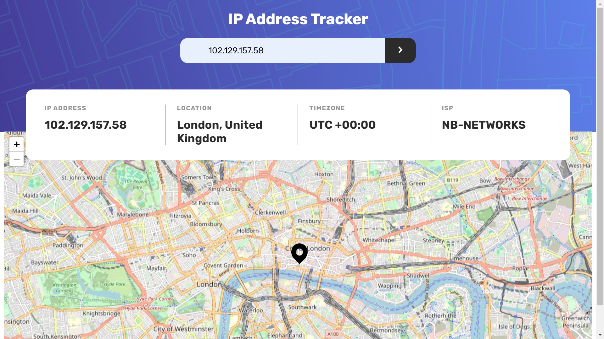

# Frontend Mentor - IP address tracker solution

This is a solution to the [IP address tracker challenge on Frontend Mentor](https://www.frontendmentor.io/challenges/ip-address-tracker-I8-0yYAH0). Frontend Mentor challenges help you improve your coding skills by building realistic projects. 

## Table of contents

- [Overview](#overview)
  - [The challenge](#the-challenge)
  - [Screenshot](#screenshot)
  - [Links](#links)
- [My process](#my-process)
  - [Built with](#built-with)
  - [What I learned](#what-i-learned)
  - [Continued development](#continued-development)
- [Author](#author)

## Overview

### The challenge

Users should be able to:

- View the optimal layout for each page depending on their device's screen size
- See hover states for all interactive elements on the page
- See their own IP address on the map on the initial page load
- Search for any IP addresses or domains and see the key information and location

### Screenshot




### Links

- Solution URL: [Github repository](https://github.com/Kelechikizito/ip-address-tracker-master)
- Live Site URL: [GitHub page](https://kelechikizito.github.io/ip-address-tracker-master/)

## My process

### Built with

- Semantic HTML5 markup
- CSS custom properties
- Flexbox
- CSS Grid
- Mobile-first workflow
- [LeafletJS](https://leafletjs.com/) - JS library for Maps
- [IPAPI](https://ipapi.co/) - IP address API


### What I learned

I learnt how to work with the LeafletJS library.


```js
function getUserIP(api) {
    fetch(api)
    .then(response => response.json())
    .then(data => {
        mapper(data.latitude, data.longitude);
        ipAddress.text(data.ip);
        userLocation.text(`${data.city}, ${data.country_name}`);
        userTimezone.text(`UTC ${data.utc_offset.slice(0,3)}:00`);
        userISP.text(data.org);
    })
    .catch(err => {
        alert(err);
        console.error(err);
    });
}
```


### Continued development

I'd get better at working with external APIs and asynchronous javascript.


## Author

- Website - [Kelechi Kizito Ugwu](https://github.com/kelechikizito)
- Frontend Mentor - [@Kelechikizito](https://www.frontendmentor.io/profile/Kelechikizito)
- Twitter - [@kelechiikizito](https://www.twitter.com/kelechiikizito)

